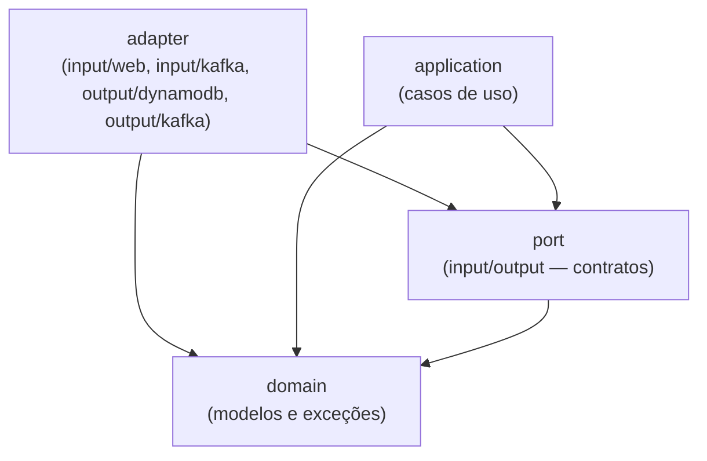
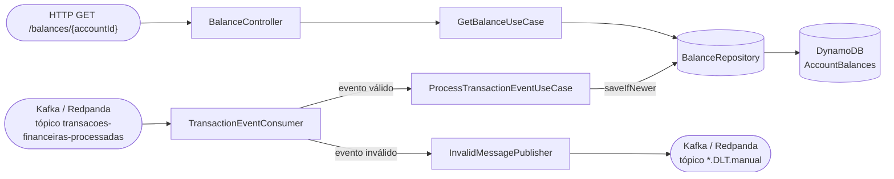

# itau-code-challenge-core-banking

[](../../actions/workflows/build.yml)
[](../../actions/workflows/test.yml)
[](../../actions/workflows/docker.yml)
[](../../actions/workflows/codeql.yml)

Microsserviço de **consulta de saldo** para o desafio técnico Itaú Unibanco (Core Banking). A aplicação consome transações financeiras já processadas por um autorizador externo em um tópico Kafka, mantém o saldo mais atual de cada conta no DynamoDB e expõe um endpoint HTTP para consultá-lo.

## Sumário

- [Escopo do desafio](#escopo-do-desafio)
- [Stack](#stack)
- [Arquitetura](#arquitetura)
- [Estrutura de pastas](#estrutura-de-pastas)
- [Regra de negócio](#regra-de-negócio)
- [Endpoints da API](#endpoints-da-api)
- [Mensageria Kafka](#mensageria-kafka)
- [Imagens Docker utilizadas](#imagens-docker-utilizadas)
- [Variáveis de ambiente](#variáveis-de-ambiente)
- [Como rodar](#como-rodar)
- [Comandos do Makefile](#comandos-do-makefile)
- [Testes](#testes)
- [Cobertura de testes](#cobertura-de-testes)
- [Trade-offs e próximos passos](#trade-offs-e-próximos-passos)

## Escopo do desafio

1. **Ingestão** — consumir transações financeiras do tópico Kafka `transacoes-financeiras-processadas` e persistir o saldo mais atual de cada conta no DynamoDB.
2. **Exposição** — disponibilizar um endpoint REST (`GET /balances/{accountId}`) para consulta do saldo mais atual de uma conta.

Um sistema de autorização (fora do escopo deste serviço) publica as transações já aprovadas/rejeitadas no tópico Kafka. Cada mensagem já inclui o **saldo mais atual do cliente** calculado pelo autorizador — esta aplicação não recalcula saldo a partir de débitos/créditos, apenas **persiste o snapshot de saldo mais recente por conta**, usando o `timestamp` do evento para decidir o que é "mais recente" (mensagens podem chegar fora de ordem).

## Stack

| Categoria | Tecnologia |
|-|-|
| Linguagem | Java 21 |
| Runtime | Java 21 (Eclipse Temurin) |
| Framework | Spring Boot 4.1.0 (Spring Framework 7) |
| Build | Gradle 9.5.1 (Groovy DSL) |
| Web | Spring MVC (`spring-boot-starter-webmvc`) |
| Observabilidade | Spring Boot Actuator (`health`, `info`, `metrics`) |
| Serialização JSON | Jackson 3 (`tools.jackson`, com suporte nativo a records) |
| Banco de dados | Amazon DynamoDB (via AWS SDK for Java v2) |
| Mensageria | Kafka (protocolo) via Spring Kafka, broker real = Redpanda |
| Testes | JUnit 5, Mockito, ArchUnit (teste de arquitetura), MockMvc, Awaitility (testes de integração) |
| Cobertura | JaCoCo (gate mínimo de 90% de instruções) |
| Containers | Docker + Docker Compose |

## Arquitetura

O projeto segue **arquitetura hexagonal**: o núcleo do negócio (domínio) não depende de nenhum framework, banco de dados ou broker de mensagens. Toda comunicação com o mundo externo passa por **portas** (interfaces) implementadas por **adaptadores**. A regra de dependência é sempre unidirecional, em direção ao domínio.



*As setas indicam "depende de" — sempre apontando em direção ao domínio.*

Essa regra é validada automaticamente por um **teste de arquitetura** (`HexagonalArchitectureTest`, usando a lib [ArchUnit](https://www.archunit.org/)), que quebra o build caso alguma camada viole a direção de dependência esperada — por exemplo, se `domain` importar algo do Spring, do Kafka ou do DynamoDB, ou se `application` importar um `adapter` diretamente.

### Camadas

#### 1. `domain` — núcleo do negócio
Modelos e exceções de domínio, sem nenhuma dependência externa (nem Spring).

- `domain/model/TransactionEvent.java` — a transação financeira já processada pelo autorizador (id, tipo, status, timestamp, conta e saldo associado).
- `domain/model/AccountBalance.java` — o saldo mais atual conhecido de uma conta, com o timestamp/transação que o originou.
- `domain/model/Balance.java` — par `amount` + `currency` (ISO 4217).
- `domain/model/TransactionType.java` — `CREDIT` / `DEBIT`.
- `domain/model/TransactionStatus.java` — `APPROVED` / `DECLINED`.
- `domain/exception/AccountBalanceNotFoundException.java` — conta sem saldo conhecido (404 na API).
- `domain/exception/InvalidTransactionEventException.java` — evento estruturalmente inválido (mensagem vai para a DLT).

#### 2. `port` — contratos do hexágono
Interfaces que definem a borda entre o núcleo e o mundo externo.

- **`port/input`** (portas de entrada / *driving*) — o que a aplicação **oferece**:
  - `GetBalanceUseCase` — consultar o saldo mais atual de uma conta.
  - `ProcessTransactionEventUseCase` — processar um evento de transação recebido via Kafka.
- **`port/output`** (portas de saída / *driven*) — o que a aplicação **precisa**:
  - `BalanceRepository` — ler/gravar o saldo de uma conta de forma atômica e condicional.
  - `InvalidMessagePublisher` — publicar uma mensagem rejeitada na DLT.

#### 3. `application` — casos de uso
Implementa os *input ports*, orquestrando regras de negócio usando apenas `domain` e `port` (nunca conhece detalhes de HTTP, Kafka ou DynamoDB).

- `GetBalanceService` — busca o saldo da conta no repositório; lança `AccountBalanceNotFoundException` se não existir.
- `ProcessTransactionEventService` — valida o evento e delega ao repositório uma escrita condicional (`saveIfNewer`), que só é aplicada se o evento for mais novo que o saldo já persistido.

#### 4. `adapter` — integrações com o mundo externo
Implementações concretas das portas, organizadas por tecnologia. Cada adaptador é isolado — trocar um por outro não exige alterar `domain` nem `application`.

- **`adapter/input/web`** (*driving adapter*, HTTP):
  - `BalanceController` — expõe `GET /balances/{accountId}`.
  - `GlobalExceptionHandler` — traduz exceções de domínio/validação em respostas HTTP (`404`, `400`, `500`), sempre em JSON.
- **`adapter/input/kafka`** (*driving adapter*, mensageria):
  - `TransactionEventConsumer` — `@KafkaListener` que consome `transacoes-financeiras-processadas`, desserializa a mensagem, mapeia para o domínio e chama `ProcessTransactionEventUseCase`. Confirma o offset manualmente (`Acknowledgment`) apenas quando a mensagem foi tratada com sucesso ou definitivamente rejeitada (erro estrutural) — em caso de falha transitória no processamento, o offset **não** é confirmado e a exceção é propagada para o container reprocessar.
  - `TransactionEventMapper` — converte o DTO do payload Kafka para `TransactionEvent`, validando estrutura (UUIDs, enums).
  - `KafkaConsumerConfig` — configura o `kafkaListenerContainerFactory` com *ack* manual e um `DefaultErrorHandler` com backoff exponencial (5 tentativas) que, ao esgotar as retentativas, publica a mensagem na DLT.
- **`adapter/output/dynamodb`** (*driven adapter*, persistência):
  - `DynamoDbBalanceRepository` — implementa `BalanceRepository`. Escreve com `PutItem` condicional (`attribute_not_exists(updated_at) OR updated_at < :newTs`) para garantir que apenas o evento mais recente por conta prevaleça, mesmo sob concorrência ou mensagens fora de ordem; lê com `GetItem` em modo *consistent read*.
  - `DynamoDbConfig` — configura o `DynamoDbClient` (endpoint, região, credenciais locais).
- **`adapter/output/kafka`** (*driven adapter*, mensageria):
  - `KafkaProducerConfig` — configura o `KafkaTemplate` usado para publicar na DLT.
  - `KafkaInvalidMessagePublisher` — implementa `InvalidMessagePublisher`; envolve o payload original em um `DltEnvelope` (motivo, tipo de erro, tópico de origem, timestamp) e publica no tópico DLT.

### Fluxo de dados



Ou seja: transações chegam via Kafka e atualizam o saldo persistido no DynamoDB (só se forem mais recentes que o que já está gravado); o endpoint HTTP lê o saldo mais atual persistido para a conta informada.

## Estrutura de pastas

```
src/main/java/br/com/itau/challenge/
├── Application.java                        # bootstrap Spring Boot
└── hello/
    ├── domain/                             # modelos e exceções de domínio
    ├── port/{input,output}/                # contratos (interfaces)
    ├── application/                        # casos de uso
    └── adapter/
        ├── input/{web,kafka}/              # driving adapters
        └── output/{dynamodb,kafka}/        # driven adapters

src/test/java/                              # testes unitários (sem infra externa)
src/integrationTest/java/                   # testes de integração (infra real via Docker)

infra/                                       # seeds de infraestrutura local (Docker Compose)
├── dynamodb/                               # script de criação da tabela AccountBalances
└── redpanda/                               # scripts de criação de tópicos e geração de eventos de teste

http/                                       # arquivos .http para chamar a API manualmente
```

> O pacote raiz do domínio ainda se chama `hello` (nome herdado do starter-kit original). Trocá-lo é possível, mas foi deliberadamente deixado de fora do escopo desta entrega para não gerar um diff gigante em cima da lógica de negócio — ver [Trade-offs e próximos passos](#trade-offs-e-próximos-passos).

## Regra de negócio

O evento publicado pelo autorizador já traz o **saldo mais atual do cliente** (`account.balance`), não um delta de crédito/débito — a aplicação não soma nem subtrai valores, apenas decide **se aquele snapshot deve substituir o que está persistido**:

- **Saldo inicial**: não existe seed de saldo — a primeira escrita bem-sucedida para uma `accountId` é o próprio primeiro evento processado.
- **Ordem/concorrência**: cada conta é identificada por `account.id` (partition key `account_id` na tabela `AccountBalances`). A escrita no DynamoDB usa `PutItem` com `ConditionExpression: attribute_not_exists(updated_at) OR updated_at < :newTs`, onde `:newTs` é o `transaction.timestamp` (microssegundos) do evento. Isso garante que o saldo persistido reflita sempre o evento com o timestamp mais recente, mesmo que mensagens cheguem fora de ordem ou dupliquem (at-least-once do Kafka) — um evento com timestamp igual ou mais antigo é silenciosamente ignorado (`saveIfNewer` retorna `false`), sem lançar erro.
- **Transações `DECLINED`**: também atualizam o saldo persistido, pois o campo `account.balance` do evento é sempre o saldo real da conta *após* a decisão do autorizador (aprovada ou não) — não há distinção de tratamento entre `APPROVED`/`DECLINED` na escrita, apenas no log.
- **Idempotência**: reprocessar o mesmo evento (mesmo `transaction.id`, mesmo `timestamp`) não altera o saldo, pois a condição de escrita exige um timestamp estritamente maior que o já persistido.
- **Eventos estruturalmente inválidos** (UUID malformado, enum desconhecido, `balance` ausente ou negativo, payload não parseável) são desviados para a DLT e o offset é confirmado — não bloqueiam o consumo dos eventos seguintes.
- **Falhas transitórias de processamento** (ex.: DynamoDB temporariamente indisponível) fazem o offset **não** ser confirmado; o `DefaultErrorHandler` reprocessa a mesma mensagem com backoff exponencial (5 tentativas) antes de desviá-la para a DLT.

## Endpoints da API

### `GET /balances/{accountId}`

Retorna o saldo mais atual de uma conta. **Sempre responde em JSON**, inclusive em erros.

| Parâmetro | Local | Tipo | Descrição |
|-|-|-|-|
| `accountId` | Path | UUID | Identificador da conta |

**Sucesso (200 OK):**
```
GET /balances/5b19c8b6-0cc4-4c72-a989-0c2ee15fa975
```
```json
{
  "id": "5b19c8b6-0cc4-4c72-a989-0c2ee15fa975",
  "owner": "315e3cfe-f4af-4cd2-b298-a449e614349a",
  "balance": {
    "amount": 183.12,
    "currency": "BRL"
  },
  "updated_at": "2025-07-05T18:04:13.433-03:00"
}
```

| Campo | Tipo | Descrição |
|-|-|-|
| `id` | UUID | Identificador da conta |
| `owner` | UUID | Identificador do titular (omitido se desconhecido) |
| `balance.amount` | Number | Saldo atual |
| `balance.currency` | String | Código ISO 4217 (ex.: `BRL`) |
| `updated_at` | String | Data/hora da última atualização (ISO 8601) |

**Erros:**

| Cenário | Status | `code` |
|-|-|-|
| Conta sem saldo conhecido | `404 Not Found` | `ACCOUNT_BALANCE_NOT_FOUND` |
| `accountId` não é um UUID válido | `400 Bad Request` | `INVALID_ACCOUNT_ID` |
| Erro inesperado (ex.: DynamoDB indisponível) | `500 Internal Server Error` | `INTERNAL_ERROR` |

Exemplos prontos em [`http/balances.http`](http/balances.http) (execute com a extensão REST Client do VS Code, o cliente HTTP do IntelliJ, ou via `make http`). Como o DynamoDB não vem pré-populado, use `make kafka-produce-transactions-events` para gerar eventos e obtenha um `accountId` real pelo Redpanda Console ou `make kafka-consume`.

## Mensageria Kafka

### Tópico `transacoes-financeiras-processadas` (entrada)

Publicado por um autorizador externo (fora do escopo). `TransactionEventConsumer` escuta este tópico e delega o processamento a `ProcessTransactionEventUseCase`.

**Schema da mensagem (JSON):**
```json
{
  "transaction": {
    "id": "8e8ae808-b154-48b5-9f3e-553935cc4543",
    "type": "CREDIT",
    "amount": 97.07,
    "currency": "BRL",
    "status": "APPROVED",
    "timestamp": 1751641364589998
  },
  "account": {
    "id": "5b19c8b6-0cc4-4c72-a989-0c2ee15fa975",
    "owner": "315e3cfe-f4af-4cd2-b298-a449e614349a",
    "created_at": 1634874339000000,
    "status": "ENABLED",
    "balance": {
      "amount": 183.12,
      "currency": "BRL"
    }
  }
}
```

| Campo | Obrigatório | Descrição |
|-|-|-|
| `transaction.id` | Sim | UUID da transação |
| `transaction.type` | Sim | `CREDIT` ou `DEBIT` |
| `transaction.status` | Sim | `APPROVED` ou `DECLINED` |
| `transaction.timestamp` | Sim | Epoch em **microssegundos**, usado para decidir qual evento é mais recente |
| `account.id` | Sim | UUID da conta (chave de particionamento no DynamoDB) |
| `account.owner` | Não | UUID do titular |
| `account.balance.amount` | Sim | Saldo da conta após a transação (não negativo) |
| `account.balance.currency` | Sim | Código ISO 4217 |

**Como publicar mensagens de teste:**
- `make kafka-produce-transactions-events TOPIC=transacoes-financeiras-processadas COUNT=50` — gera eventos aleatórios (contas distintas a cada execução).
- Pelo Redpanda Console (http://localhost:8081) → tópico `transacoes-financeiras-processadas` → *Produce Message*.
- `make kafka-seed` — roda novamente o job de seed (cria os tópicos se não existirem e publica 20 eventos de teste).

### Tópico `transacoes-financeiras-processadas.DLT.manual` (saída)

Destino de mensagens que não puderam ser processadas: falha de desserialização, evento estruturalmente inválido, ou falha de processamento após esgotar as retentativas. Cada mensagem é publicada como um `DltEnvelope`:

```json
{
  "originalPayload": "...payload original recebido...",
  "reason": "motivo do erro",
  "errorType": "DESERIALIZATION_ERROR | VALIDATION_ERROR | PROCESSING_ERROR",
  "sourceTopic": "transacoes-financeiras-processadas",
  "failedAt": "2025-07-05T18:04:13.433Z"
}
```

## Imagens Docker utilizadas

| Serviço | Imagem | Finalidade |
|-|-|-|
| `app` | build local (`eclipse-temurin:21-jdk` → `eclipse-temurin:21-jre`) | a própria aplicação |
| `dynamodb` | `amazon/dynamodb-local:3.3.0` | DynamoDB local (modo in-memory) |
| `dynamodb-seed` | `amazon/aws-cli:2.36.8` | cria a tabela `AccountBalances` (sem dados iniciais — o saldo é populado pelos eventos Kafka) |
| `dynamodb-admin` | `aaronshaf/dynamodb-admin:5.3.4` | console web para inspecionar a tabela |
| `redpanda` | `docker.redpanda.com/redpandadata/redpanda:v26.1.14` | broker Kafka-compatível (modo KRaft, single-node) |
| `redpanda-seed` | `docker.redpanda.com/redpandadata/redpanda:v26.1.14` | aplica a config do cluster (`config.sh`), depois cria os tópicos `transacoes-financeiras-processadas`/DLT e publica eventos de teste (`seed.sh`), usando `rpk` |
| `redpanda-console` | `docker.redpanda.com/redpandadata/console:v3.9.0` | console web para inspecionar tópicos/mensagens |

> Todas as imagens usam versões fixas (nunca `latest`) para builds reprodutíveis.

> **Por que Redpanda em vez do Apache Kafka?** É um binário único em C++ (sem JVM, sem ZooKeeper), com startup quase instantâneo — mais leve para ambiente local, mantendo 100% de compatibilidade com o protocolo Kafka (a aplicação usa `spring-kafka` normalmente, sem nenhum código específico do Redpanda).

## Variáveis de ambiente

Todas têm valor padrão para desenvolvimento local (fora do Docker Compose) e são sobrescritas dentro do `docker-compose.yml` para apontar para os hostnames internos dos containers.

| Variável | Padrão (local) | Descrição |
|-|-|-|
| `DYNAMODB_ENDPOINT` | `http://localhost:8000` | endpoint do DynamoDB |
| `DYNAMODB_REGION` | `us-east-1` | região (fake, para o SDK) |
| `BALANCES_TABLE_NAME` | `AccountBalances` | tabela do DynamoDB (partition key `account_id`) |
| `KAFKA_BOOTSTRAP_SERVERS` | `localhost:19092` | broker Kafka/Redpanda |
| `KAFKA_CONSUMER_GROUP_ID` | `consulta-saldo-consumer` | group id do consumer |
| `TRANSACTIONS_TOPIC` | `transacoes-financeiras-processadas` | tópico consumido |
| `TRANSACTIONS_DLT_TOPIC` | `transacoes-financeiras-processadas.DLT.manual` | tópico de destino das mensagens rejeitadas |

## Como rodar

Pré-requisito único: **Docker** (com Docker Compose). O `make` já vem instalado por padrão em Linux e macOS; no Windows, use o **WSL2** (o Makefile depende de utilitários estilo Unix e não roda direto no PowerShell/cmd).

```bash
make up                                                                              # sobe tudo em background: app + DynamoDB + Redpanda (+ seeds + consoles)
make logs                                                                            # acompanha os logs da aplicação
make kafka-produce-transactions-events TOPIC=transacoes-financeiras-processadas COUNT=10  # gera eventos de teste
# copie um account.id publicado (Redpanda Console ou `make kafka-consume TOPIC=transacoes-financeiras-processadas`)
curl "http://localhost:8080/balances/<accountId>"
make stop                                                                            # derruba tudo
```

Consoles web disponíveis depois de subir a stack:

| Console | URL |
|-|-|
| Aplicação | http://localhost:8080 |
| Aplicação — health/metrics | http://localhost:8080/actuator/health |
| DynamoDB Admin | http://localhost:8001 |
| Redpanda Console | http://localhost:8081 |

### Loop de desenvolvimento rápido (rodando pela IDE)

Para iterar mais rápido durante o desenvolvimento — com debugger, breakpoints e sem reconstruir a imagem Docker a cada mudança — rode a aplicação direto pela IDE em vez de `make up`/`make run`:

```bash
make db-up        # só DynamoDB Local + console web
make kafka-up  # só Redpanda + console web
```

Esses comandos retornam assim que os containers **sobem**, não quando os jobs de seed **terminam** — espere alguns segundos (acompanhe com `make logs` ou pelos consoles web) antes de rodar a aplicação, senão ela pode consultar a tabela/tópico antes de estarem prontos.

Depois rode `Application.java` (ou `./gradlew bootRun`) direto pela IDE. Os valores padrão em `application.yaml` (`localhost:8000` para o DynamoDB, `localhost:19092` para o Redpanda) já apontam para essas portas — nenhuma variável de ambiente extra é necessária.

### Solução de problemas

- **Primeiro `make up` demorando:** na primeira execução o Docker baixa ~5 imagens (`dynamodb-local`, `aws-cli`, `redpanda`, `redpanda-console`, `dynamodb-admin`), então pode levar alguns minutos dependendo da sua internet. Acompanhe com `make logs` — se não houver progresso nenhum por vários minutos, aí sim algo está errado.
- **Erro `port is already allocated` / `address already in use`:** a stack ocupa as portas `8080` (app), `8000`/`8001` (DynamoDB), `8081` (Redpanda Console) e `9092`/`19092` (Redpanda). Libere a porta em conflito (encerrando o processo que a está usando) ou pare qualquer outra stack local que já esteja rodando.
- **`GET /balances/{accountId}` retornando 404 para tudo:** o DynamoDB não vem pré-populado — gere eventos com `make kafka-produce-transactions-events` e consulte um `accountId` que realmente foi publicado.
- **Ficou algo travado/inconsistente:** `make clean-containers` remove todos os containers do projeto (rodando ou parados, incluindo órfãos) para você começar do zero.

## Comandos do Makefile

Execute `make help` a qualquer momento para ver esta lista no terminal.

### Aplicação

| Comando | Descrição |
|-|-|
| `make build` | constrói a imagem Docker de runtime da aplicação |
| `make run` | sobe a stack em primeiro plano (logs no terminal) |
| `make up` | sobe a stack em background |
| `make logs` | acompanha os logs da aplicação (`docker compose logs -f`) |
| `make stop` | derruba os containers da stack (`docker compose down`) |
| `make http` | chama os arquivos `.http` contra a app rodando (via container Node, sem dependência local) |

### DynamoDB

| Comando | Descrição |
|-|-|
| `make db-up` | sobe o DynamoDB Local + console web e cria a tabela `AccountBalances` |
| `make db-seed` | roda novamente o job de criação da tabela (idempotente) |
| `make db-scan` | lista todos os saldos atualmente na tabela `AccountBalances` |
| `make db-down` | para o DynamoDB Local + console web |

### Kafka / Redpanda

> **Nota:** a criação automática de tópicos (`auto_create_topics_enabled`) fica desabilitada por `infra/redpanda/config.sh` logo que o cluster sobe (roda antes de `seed.sh`, no mesmo container `redpanda-seed`). Ou seja, tópicos precisam ser criados explicitamente — via `make kafka-topic-create` ou pelo próprio seed — antes de produzir/consumir mensagens.

| Comando | Descrição |
|-|-|
| `make kafka-up` | sobe o Redpanda + console web, cria os tópicos `transacoes-financeiras-processadas`/DLT e publica eventos de teste |
| `make kafka-seed` | roda novamente o job de seed (cria os tópicos se não existirem; mensagens são republicadas — tópicos Kafka são *append-only*, então o total de mensagens cresce a cada execução) |
| `make kafka-topic-create NAME=meu-topico [PARTITIONS=3]` | cria um novo tópico no Redpanda com o nome e o número de partições informados (`PARTITIONS` é opcional, padrão `1`) |
| `make kafka-produce-accounts-events TOPIC=meu-topico [COUNT=50]` | produz eventos de teste no formato `{"account": {...}}` (id/owner UUID aleatórios, `created_at` aleatório nos últimos 10 minutos, `status` ENABLED/DISABLED aleatório) para o tópico informado (`COUNT` é opcional, padrão `100`) |
| `make kafka-produce-transactions-events TOPIC=meu-topico [COUNT=50]` | produz eventos de teste no formato `{"transaction": {...}, "account": {...}}` (id's UUID aleatórios, `type` CREDIT/DEBIT, `amount` aleatório de 0.01 a 10000, `status` APPROVED/DECLINED, `timestamp` aleatório nos últimos 10 minutos; `account.created_at` aleatório nos últimos 10 anos, `account.status` sempre ENABLED, `balance.amount` aleatório de 0.00 a 20000) para o tópico informado (`COUNT` é opcional, padrão `100`) |
| `make kafka-consume TOPIC=meu-topico` | imprime todas as mensagens atualmente no tópico informado (usa timeout de 5s, já que `rpk topic consume` não tem um modo "ler o que existe e sair") |
| `make kafka-down` | para o Redpanda + console web |

### Testes

| Comando | Descrição |
|-|-|
| `make test` | constrói a imagem de teste e roda `./gradlew check` (testes unitários + gate de cobertura ≥ 90%) dentro de um container — não precisa de nenhuma infra externa |
| `make integration-test` | sobe DynamoDB + Redpanda reais e roda `./gradlew integrationTest` contra eles |

### Limpeza

| Comando | Descrição |
|-|-|
| `make clean-containers` | remove **todos** os containers do projeto (rodando ou parados), incluindo órfãos de serviços renomeados/removidos |
| `make clean` | remove as imagens Docker construídas localmente |

## Testes

O projeto tem duas suítes de teste bem separadas:

### `src/test` — testes unitários (`./gradlew test`)
Não dependem de nenhuma infraestrutura externa — rodam em qualquer lugar, inclusive dentro do container Docker de teste (`make test`), sem Docker-in-Docker.

- Testes de domínio, aplicação e adapters usando **fakes/mocks** para os *ports* (nenhuma chamada real a DynamoDB ou Kafka), cobrindo o caminho feliz e casos de borda: eventos duplicados/fora de ordem, saldo negativo, UUID inválido, `owner` ausente, falhas de infraestrutura propagadas corretamente.
- `BalanceControllerTest` usa `MockMvc` + `@MockitoBean` para isolar a camada web (200, 404, 400, 500).
- `HexagonalArchitectureTest` valida a direção de dependências entre as camadas (ArchUnit).

### `src/integrationTest` — testes de integração (`./gradlew integrationTest`)
Rodam contra infraestrutura **real**, subida via Docker Compose. Ficam propositalmente fora do `check`/`test` para não exigir infra no pipeline padrão.

- `DynamoDbBalanceRepositoryIntegrationTest` — grava e lê saldo de uma tabela DynamoDB real (`make db-up`), incluindo o cenário de não sobrescrever saldo com evento mais antigo.
- `TransactionEventConsumerIntegrationTest` — sobe o contexto Spring real (incluindo o `@KafkaListener` de produção) conectado ao broker Redpanda real (`make kafka-up`); publica uma mensagem no tópico e valida que o saldo é persistido, e que mensagens estruturalmente inválidas não afetam o saldo.

Rode com `make integration-test` (sobe a infra necessária automaticamente antes de executar).

## Cobertura de testes

Configurado com **JaCoCo**, gate mínimo de **90% de cobertura de instruções**, que falha o build (`./gradlew check`) se não for atingido. Um resumo legível é impresso diretamente no output do Gradle (sem precisar abrir o relatório HTML), com contagem por tipo de métrica (instruções, branches, linhas, complexidade, métodos, classes) e o veredito do gate.

Relatório HTML completo em `build/reports/jacoco/test/html/index.html` após rodar `./gradlew test` ou `make test`.

## Trade-offs e próximos passos

Dado o prazo do desafio, ficaram de fora — documentados aqui conforme sugerido no enunciado:

- **Circuit breaker nas chamadas ao DynamoDB**: hoje a resiliência é tratada apenas no nível do consumer Kafka (retry com backoff exponencial antes de ir para a DLT). Um circuit breaker (ex.: Resilience4j) em `DynamoDbBalanceRepository` evitaria sobrecarregar o DynamoDB com tentativas durante uma indisponibilidade prolongada e permitiria falhar rápido no `GET /balances/{accountId}` nesse cenário.
- **Índice secundário por `owner`**: a tabela `AccountBalances` só é consultada por `account_id` (o único caso de uso pedido). Um GSI por `owner` seria necessário caso surja o requisito de consultar todos os saldos de um titular.
- **Renomear o pacote raiz `hello`**: nome herdado do starter-kit original; mantido para não gerar um diff desnecessariamente grande em cima da lógica de negócio nesta entrega.
- **Métricas de negócio dedicadas**: o Actuator expõe métricas técnicas padrão (JVM, HTTP, Kafka listener); métricas específicas de domínio (ex.: contagem de eventos rejeitados por tipo de erro, latência de ponta a ponta evento→saldo persistido) ficariam a cargo de um `MeterRegistry` customizado.
